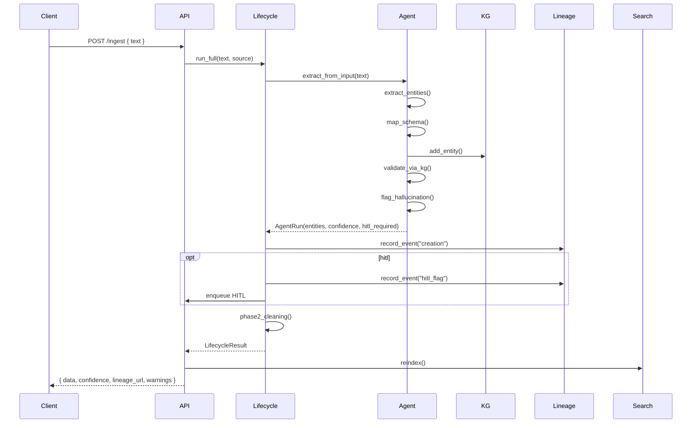

# Architecture

## Layered design

```
┌────────────────────────────────────────────────────────────┐
│ Surfaces                                                   │
│  • Streamlit UI  (streamlit_app.py)                        │
│  • FastAPI REST  (metadata_kg.api.routes)                  │
└──────────────────────┬─────────────────────────────────────┘
                       │
┌──────────────────────▼─────────────────────────────────────┐
│ Lifecycle (pipeline.lifecycle.MetadataLifecycle)           │
│   Phase 1 Creation → Phase 2 Cleaning →                    │
│   Phase 3 Maintenance → Phase 4 Retirement                 │
└──────┬─────────────────────┬─────────────┬─────────────────┘
       │                     │             │
┌──────▼──────┐  ┌───────────▼─────────┐  ┌▼──────────────┐
│ Core        │  │ Governance          │  │ Search        │
│ • KG        │  │ • Lineage (PROV-O)  │  │ • SemanticKG  │
│ • Agent     │  │ • Policy (GDPR)     │  │   - ST/BM25   │
│ • Schema    │  │ • XAI               │  │   - hybrid    │
└─────────────┘  └─────────────────────┘  └───────────────┘
```

## Module responsibilities

| Module | Role | Key types |
|--------|------|-----------|
| `core.metadata_schema` | DCAT 2 / DCMI Pydantic models, namespace bindings | `DCATDataset`, `DCMIType`, `Agent` |
| `core.kg_builder` | Dual-store KG (rdflib + networkx), validation, Turtle I/O, cross-domain linking | `MetadataKnowledgeGraph`, `link_cross_domain` |
| `core.llm_agent` | LLM-as-Agent (LangChain + Claude) + deterministic fallback. Tools: extract / map / validate / flag_hallucination | `MetadataAgent`, `AgentRun`, `Entity` |
| `pipeline.ingest` | Multi-format ingestion (text/JSON/YAML/PDF) | `ingest_any` |
| `pipeline.extract` | Wraps agent run for a payload | `extract_from_input` |
| `pipeline.validate` | Per-entity + full-graph validation | `validate_entity`, `validate_graph` |
| `pipeline.lifecycle` | Coordinates the 4 lifecycle phases, emits lineage events | `MetadataLifecycle`, `LifecycleResult` |
| `governance.lineage` | PROV-O event store, JSON-LD export, thread-safe | `DataLineage`, `LineageEvent` |
| `governance.policy` | YAML-loadable policy engine, GDPR PII detectors | `PolicyEngine`, `detect_pii` |
| `governance.xai` | Human-readable explanation + per-field confidence | `ExplainabilityLayer` |
| `search.semantic_search` | Sentence-transformers OR hashed fallback + BM25 + hybrid + query expansion | `SemanticMetadataSearch`, `SearchResult` |
| `api.routes` | FastAPI app with envelope response format, HITL queue | `app`, `AppState` |

## Data flow per ingest call



## Confidence thresholds

| Stage | Default threshold | Behavior when below |
|-------|------------------|---------------------|
| `flag_hallucination` | `< 0.7` | Add `hitl_flag` event, enqueue for human review |
| `validate_via_kg` | binary | If invalid, force HITL regardless of score |
| `phase2_cleaning` dedup | Jaccard `≥ 0.85` | Insert `mkg:sameAs` triple between duplicates |

## Persistence

Defaults are in-process. To persist:

- **KG snapshot** → `kg.export_to_turtle(path)` / `kg.load_from_turtle(path)`
- **Lineage events** → instantiate `DataLineage(storage_dir=...)`; each event auto-appends to `<entity_id>.jsonl`
- **HITL queue** is in-memory; persist by mirroring it to your own store before container restart

## Extension points

1. **New domain extension**: add a value to `DomainExtension`, attach `domain_properties` to your `DCATDataset`.
2. **Custom policy rules**: write YAML and call `PolicyEngine.load_rules(path)`.
3. **Custom embeddings**: pass a different `model_name` to `SemanticMetadataSearch(model_name=...)`.
4. **Replace LLM**: subclass `MetadataAgent` and override `_build_executor`; the lifecycle is LLM-agnostic.
